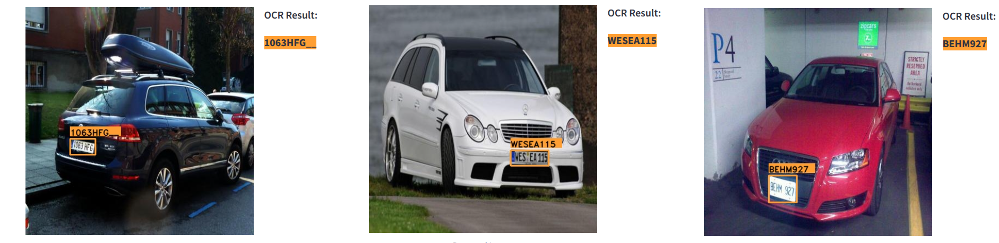

<div style="text-align: center;">
  <h1> License Plate Detection </h1>
  <p></p>
</div>
<!-- <div align="center"></div> -->
<div align="center"></div>

## Introduction
This repository contains the source code for utilizing [YOLOX](https://github.com/Megvii-BaseDetection/YOLOX/tree/main).
This project aims to detect license plates and extract their information using OCR.
A pretrained [Yolox-s](https://github.com/Megvii-BaseDetection/YOLOX/releases/download/0.1.1rc0/yolox_s.pth) is used for training.


## Dataset 
I have combined two dataset from [kaggle](https://www.kaggle.com/datasets/andrewmvd/car-plate-detection) and [roboflow](https://public.roboflow.com/object-detection/license-plates-us-eu/3) for training, testing and inference.
You can use ``datasets/voc_to_coco.py`` script to convert VOC format to COCO format.

COCO format - [Details](datasets/README.md)


## Download Yolox-s model for license plate detection

|Format     | Weights       |
|-----------|---------------|
|pth        | [drive](https://drive.google.com/file/d/1SIIbuCqr6vLvKM6oiCOjmJ0Bm1EK9-Kb/view?usp=drive_link) |
|trt        | [drive](https://drive.google.com/file/d/1ahZzQfvGuVUv_fpRnGQkZmLJ2AIvPDSv/view?usp=drive_link) |
|trt-engine | [drive](https://drive.google.com/file/d/1C0sX8AfMigvklz3T_SxCTmhEh9DJ9yjQ/view?usp=drive_link) |
|onnx       | [drive](https://drive.google.com/file/d/1rvtBnxedeH26ncGcrlZUmpkUwEc4eh06/view?usp=drive_link) |

### mAP Testing Score
|IoU        | mAP           |
|-----------|---------------|
|0.5        | 93.8%         | 
|0.7        | 84.0%         |
|0.5:0.95   | 69.5%         |


## OCR Implementation
In this repo, I have used two OCR library with their pretrained weights.
- PaddleOCR      - [github](https://github.com/PaddlePaddle/PaddleOCR)
- fast-plate-ocr - [github](https://github.com/ankandrew/fast-plate-ocr)

## Quick Start

<details>
<summary>Installation</summary>

Step1. Install YOLOX from source.
```shell
git clone git@github.com:Megvii-BaseDetection/YOLOX.git
cd YOLOX

# Install from command line
# PyTorch with CUDA 11.8 support
pip install torch torchvision torchaudio --index-url https://download.pytorch.org/whl/cu118
pip3 install -r requirements
pip3 install -v -e .  # or  python3 setup.py develop

# OR
# Install with bash file
sh install.sh
```

</details>


<details>
<summary>Train </summary>

Step1. Prepare COCO dataset
```shell
cd <YOLOX_HOME>
ln -s /path/to/your/COCO ./datasets/COCO
```

Step2. Reproduce our results on COCO by specifying -n:

```shell
python -m yolox.tools.train -n yolox-s -d 8 -b 64 --fp16 -o [--cache]
                               yolox-m
                               yolox-l
                               yolox-x
```
* -d: number of gpu devices
* -b: total batch size, the recommended number for -b is num-gpu * 8
* --fp16: mixed precision training
* --cache: caching imgs into RAM to accelarate training, which need large system RAM.


When using -f, the above commands are equivalent to:
```shell
python -m yolox.tools.train -f exps/default/yolox_s.py -d 8 -b 64 --fp16 -o [--cache]
                               exps/default/yolox_m.py
                               exps/default/yolox_l.py
                               exps/default/yolox_x.py
```

**Multi Machine Training**

We also support multi-nodes training. Just add the following args:
* --num\_machines: num of your total training nodes
* --machine\_rank: specify the rank of each node

Suppose you want to train YOLOX on 2 machines, and your master machines's IP is 123.123.123.123, use port 12312 and TCP.

On master machine, run
```shell
python tools/train.py -n yolox-s -b 128 --dist-url tcp://123.123.123.123:12312 --num_machines 2 --machine_rank 0
```
On the second machine, run
```shell
python tools/train.py -n yolox-s -b 128 --dist-url tcp://123.123.123.123:12312 --num_machines 2 --machine_rank 1
```

**Logging to Weights & Biases**

To log metrics, predictions and model checkpoints to [W&B](https://docs.wandb.ai/guides/integrations/other/yolox) use the command line argument `--logger wandb` and use the prefix "wandb-" to specify arguments for initializing the wandb run.

```shell
python tools/train.py -n yolox-s -d 8 -b 64 --fp16 -o [--cache] --logger wandb wandb-project <project name>
                         yolox-m
                         yolox-l
                         yolox-x
```

An example wandb dashboard is available [here](https://wandb.ai/manan-goel/yolox-nano/runs/3pzfeom0)

**Others**

See more information with the following command:
```shell
python -m yolox.tools.train --help
```

</details>


<details>

<summary>Evaluation</summary>

We support batch testing for fast evaluation:

```shell
python -m yolox.tools.eval -n  yolox-s -c yolox_s.pth -b 64 -d 8 --conf 0.001 [--fp16] [--fuse]
                               yolox-m
                               yolox-l
                               yolox-x
```
* --fuse: fuse conv and bn
* -d: number of GPUs used for evaluation. DEFAULT: All GPUs available will be used.
* -b: total batch size across on all GPUs

To reproduce speed test, we use the following command:
```shell
python -m yolox.tools.eval -n  yolox-s -c yolox_s.pth -b 1 -d 1 --conf 0.001 --fp16 --fuse
                               yolox-m
                               yolox-l
                               yolox-x
```

</details>

<details>
<summary>Inference </summary>

Step1. Download a pretrained model from the Yolox-s table.

Step2. Use either -n or -f to specify your detector's config. For example:

## Inference with Demo file
Demo for image:
```shell
python tools/demo.py image -n yolox-s -c /path/to/your/yolox_s.pth --path assets/car.jpg --conf 0.25 --nms 0.45 --tsize 640 --save_result --device [cpu/gpu]
```
or
```shell
python tools/demo.py image -f exps/default/yolox_s.py -c /path/to/your/yolox_s.pth --path assets/car.jpg --conf 0.25 --nms 0.45 --tsize 640 --save_result --device [cpu/gpu]
```
Demo for video:
```shell
python tools/demo.py video -n yolox-s -c /path/to/your/yolox_s.pth --path /path/to/your/video --conf 0.25 --nms 0.45 --tsize 640 --save_result --device [cpu/gpu]
```

## Inference trt 
```shell
python tools/demo.py image -n yolox-s -c /path/to/your/yolox_s.pth --path assets/car.jpg --conf 0.25 --nms 0.45 --tsize 640 --save_result --device [cpu/gpu] --trt 
```

## Inference onnx
```shell 
python demo/ONNXRuntime/onnx_inference.py -m <ONNX_MODEL_PATH>  -i <IMAGE_PATH> -o <OUTPUT_DIR> -s 0.3 --input_shape 640,640
```

## Inference using streamlit app
```
streamlit run tools/stremlit_det_ocr.py
```
</details>

<details>
<summary>Tutorials</summary>

*  [Training on custom data](docs/train_custom_data.md)
*  [Caching for custom data](docs/cache.md)
*  [Manipulating training image size](docs/manipulate_training_image_size.md)
*  [Assignment visualization](docs/assignment_visualization.md)
*  [Freezing model](docs/freeze_module.md)

</details>

## Deployment

1. [ONNX export and an ONNXRuntime](./demo/ONNXRuntime)
2. [TensorRT in C++ and Python](./demo/TensorRT)

## Reference
https://github.com/Megvii-BaseDetection/YOLOX

## Cite YOLOX
If you use YOLOX in your research, please cite our work by using the following BibTeX entry:

```latex
 @article{yolox2021,
  title={YOLOX: Exceeding YOLO Series in 2021},
  author={Ge, Zheng and Liu, Songtao and Wang, Feng and Li, Zeming and Sun, Jian},
  journal={arXiv preprint arXiv:2107.08430},
  year={2021}
}
```
